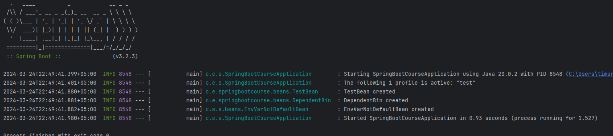

# SpringBootCourse

Это мой репозиторий с домашками по курсу Spring Boot

Хабибулин Тимур, группа РИ-220913, преподаватель - Пиксаева А. Ю.

## ДЗ по теме Конфиги и профили
1) Создать 3 профиля - dev, test, prod, каждый из которых будет включать в себя:
   - конфиг с листом из нескольких значений;
   - название приложения;
   - конфиг с переменной окружения, по дефолту значение - default;

2) Описать  3 бина:
   - один создается, только если профиль test;
   - другой, если существует первый бин;
   - третий, если в конфиге EXAMPLE_TEST (env var) не default (тут в идеале со скриншотом)

P.S. тот самый скриншот:
